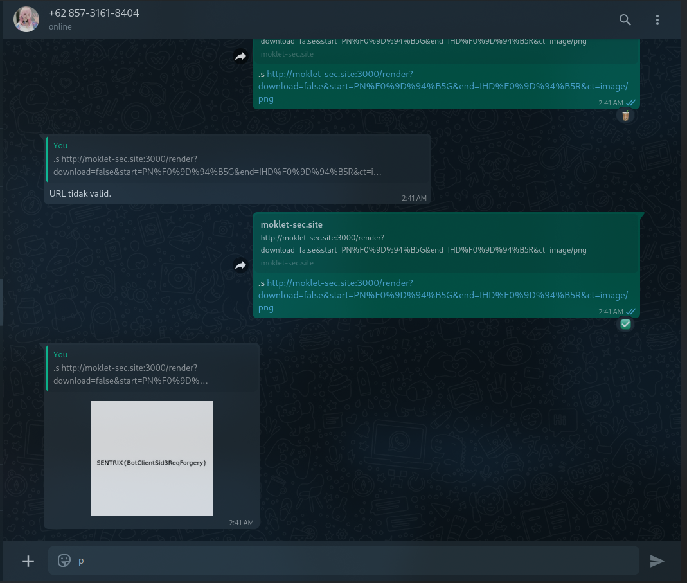

# Leazy
Description:
He127.l.l.0day World!, Udah cape kalo chall ctf itu gak relate sama real-life? di chall kali ini relate bgt tuh 😂 sama real-case.
heker y bg?
## Difficulty rating : easy

### Concept tldr
- Attacker attack bot whatsapp and found ssrf on bot whatsapp side
- Using non-utf8 chars to bypass validation to get generation real fixed flag image on bot flag side need ip from an ssrf
- Set content-type to image whatsapp
The final payload should like this : `http://localhost:3000/render?download=false&start=PN%F0%9D%94%B5G&end=IHD%F0%9D%94%B5R&ct=image/png` 
